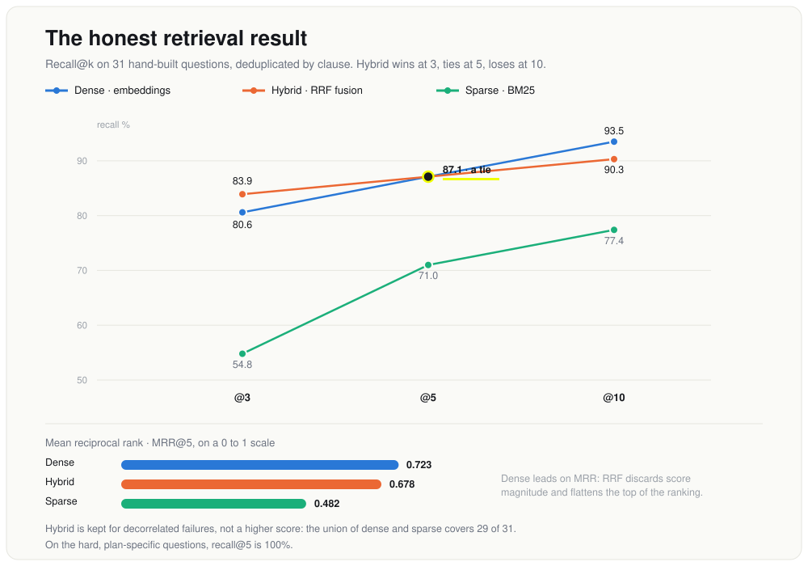

# Insurance Policy Q&A (RAG)

Ask a health insurance policy a plain-English question and get an answer grounded in the policy
text, with the exact clause it came from. If the policy does not answer the question, the system
says so instead of guessing.


📄 **Case study:** https://www.hridaysaha.com/projects-1/a-straight-answer-from-the-fine-print
🔗 **Live demo:** https://insurance-policy-rag.onrender.com

Clone it and everything runs on your machine: no API key, no billing, nothing to sign up for.
Generation uses a local model through [Ollama](https://ollama.com), so anyone who clones the repo
can run the whole pipeline end to end, including the FastAPI backend. An Anthropic backend is
included as an optional frontier baseline, but nothing here depends on it. The public live demo is
the exception: to fit a free 512 MB host it offloads query embedding to a hosted `all-mpnet-base-v2`
endpoint (the identical model the index was built with, so retrieval is byte-for-byte the same) and
runs answer generation on a free hosted model. Retrieval numbers below are measured on the local
models; treat the demo's answer fluency as illustrative, not as the eval result.

## Results

Measured on 34 hand-built questions (31 answerable with known gold clauses, 3 deliberate refusals)
over a real 291-page prospectus. Retrieval ablation is like-for-like: all three retrievers are
deduplicated by section, so `k` means k distinct clauses.

| retriever | recall@3 | recall@5 | recall@10 | MRR@5 |
|---|---|---|---|---|
| dense (SBERT + FAISS) | 80.6% | **87.1%** | **93.5%** | **0.723** |
| sparse (BM25) | 54.8% | 71.0% | 77.4% | 0.482 |
| hybrid (RRF) | **83.9%** | 87.1% | 90.3% | 0.678 |

Recall@5 by difficulty (hybrid): easy 85.7%, medium 72.7%, **hard 100%**. The hard questions are the
plan-specific ones, where a single-answer response is wrong for at least two of the eight plans. That
100% is the hand-structured Annexure A working.

Generation, all 34 questions, `qwen2.5:14b-instruct` local. Every metric is deterministic (set
membership, status checks), so no model grades a model:

| metric | value |
|---|---|
| retrieval: gold clause in top-5 | 27/31 (87%) |
| citations verified (cited what it was shown) | **34/34 (100%)** |
| cited the correct clause | 27/30 (90%) |
| correctly refused the 3 unanswerable | 3/3 (100%) |
| wrongly refused an answerable one | 1/31 (3%) |
| plan-dependent questions flagged | 4/4 (100%) |

> **Honest reading.** n=34 is small: every figure carries roughly ±3 points per question, the
> generation run is a single pass, and nothing is validated on a held-out split. And the hybrid does
> **not** beat dense on this question set (it wins at k=3, ties at k=5, loses at k=10 and on MRR).
> The value here is the pipeline and the honesty of the measurement, not any single headline number.

<p align="center">
  
</p>

## Why this is non-trivial

- **It is eight plans, not one.** Optima Suraksha, Secure, Super Secure, Secure Global, Secure Global
  Plus, Select, Lite, Secure +. They share one clause set, so most questions have a different correct
  answer per plan. Room rent is "At Actuals" in six plans, capped at 1% of base sum insured in one,
  and a Single Private room in another. A system that retrieves the clause but drops the plan
  qualifier gives confidently wrong answers about money.
- **Refusal is the model's judgment, not a retrieval-score threshold.** The intended cheap gate (no
  chunk above threshold means no answer) fails: answerable and unanswerable questions overlap almost
  entirely on retrieval score. Any threshold that rejects all 3 unanswerable questions also rejects 29
  of the 31 answerable ones. Answerability is a different property from topical relatedness.
- **Citations are verified, not trusted.** Every section the model cites is checked against what was
  actually placed in its context window. A fabricated citation is the one failure a reader cannot
  catch, because it is exactly the thing people trust without checking. This is a hard check, not a
  prompt instruction, which matters with a small local model.
- **Chunks follow clause boundaries, never fixed windows.** A 512-token window cutting through a
  waiting-period rule leaves half in each chunk and neither answers the question. Chunk ids follow the
  document's own numbering, so the id doubles as the citation anchor a user needs to find it in the PDF.
- **Annexure A is transcribed by hand, and the transcription is tested.** The plan-comparison matrix
  is the only place saying what a benefit is worth per plan, and the PDF text layer collapses its
  eight columns into an unusable vertical stream. `tests/test_annexure_a.py` checks every transcribed
  value against the source page it claims to come from.

## Approach

Offline, a policy PDF is cleaned (frequency-based boilerplate stripping, not regex), chunked on clause
boundaries, and indexed twice. Per question, hybrid retrieval returns the top-five distinct clauses; a
constrained LLM answers only from those clauses and emits a schema-constrained JSON object; every cited
clause is verified against the retrieved context; the result is an answer or a refusal.

<p align="center">
  
</p>

## Data

A real 291-page health insurance prospectus. Only about 71 pages carry policy text; the rest is
numeric rate charts, excluded on purpose.

| Pages | Content | In the index? |
|---|---|---|
| 1-58 | Policy body: coverage, exclusions, claims, terms | yes |
| 59-66 | Annexure A, the plan comparison matrix | yes, hand-structured |
| 67-68 | Annexure B, non-medical items | yes |
| 69-288 | Premium rate charts (age × sum insured × plan × city tier) | **no** |
| 289-291 | Lists II/III/IV, non-payable items | yes |

Pages 69-288 are 220 pages of pure numeric lookup. Embedding them would flood the index with
near-identical numeric chunks, and "what is the premium for a 35-year-old" is a structured lookup, not
a semantic retrieval problem. Premium questions are therefore an explicit, documented `out_of_scope`
refusal, not a pretend answer.

## Model

**Retrieval is hybrid**, because insurance rewards exact match and paraphrase equally.

- **Dense**: Sentence-BERT (`all-mpnet-base-v2`) over a FAISS `IndexFlatIP`, cosine similarity. Catches
  paraphrase ("treatment at home instead of being admitted" finds the "Home Health Care" clause).
- **Sparse**: BM25 with Snowball stemming. "Co-payment", "deductible" and "sub-limit" are three
  different financial things a bi-encoder places close together; "Optima Secure" and "Optima Super
  Secure" differ by one token and by crores. BM25 matches tokens, not vibes.
- **Fusion**: Reciprocal Rank Fusion, plus a BM25 signal gate that drops sparse hits below 40% of
  BM25's own top hit for the query. Without the gate, RRF fuses ranks and ignores magnitude, so noisy
  tail hits with real rank positions beat the true clause. The 0.4 is chosen for the mechanism, not
  tuned to the eval set.

**Generation** is constrained to answer only from the retrieved clauses, cite the section it used, and
refuse when the policy does not answer. It returns machine-checkable JSON, not prose. Refusal is a
first-class outcome in the prompt, with the deterministic citation check as the backstop underneath.

## Evaluation

Retrieval uses **recall@k and MRR** because the retriever's one job is to place the gold clause in the
top-k the generator sees; precision over the whole corpus is irrelevant when k is fixed at 5.
Generation metrics are all deterministic (citation-in-context, status match, plan-flag set membership),
which avoids the circularity of using the only available model to grade itself. The question set is
never tuned on: thresholds like the BM25 gate are picked for their mechanism, and taking a lone recall
spike inside an otherwise flat band would be fitting n=34.

## Reproduce it

Generation runs locally through Ollama. Runs are deterministic (`temperature=0`, exact-search FAISS +
BM25), so there is no seed to set and the numbers regenerate exactly.

```bash
ollama pull qwen2.5:14b-instruct
python3.12 -m venv .venv && .venv/bin/pip install -r requirements.txt

# place the prospectus PDF at data/raw/ (see data/raw/README.md), then:
.venv/bin/python -m scripts.build_index        # PDF -> chunks -> FAISS + BM25 (with invariant checks)
.venv/bin/python -m scripts.verify_retrieval   # regenerates the retrieval table
.venv/bin/python -m scripts.evaluate           # regenerates the generation table
.venv/bin/python -m pytest tests/ -q           # 49 tests: chunking, Annexure A, guards, API contract

# ask one question end to end, or serve it:
.venv/bin/python -m scripts.ask "is maternity covered in the first year"
.venv/bin/uvicorn src.api.app:app --reload
```

The `/ask` response carries the answer plus `status` (`answered` / `not_in_document` / `out_of_scope`)
and `citations_verified`, so a caller can branch on a refusal or an unverifiable citation without
parsing prose. `build_index` refuses to emit a duplicate chunk id or an over-window chunk; both were
real silent bugs. Hosted-demo deploy details are in [docs/DEPLOY-RENDER.md](docs/DEPLOY-RENDER.md).

## Repo map

```
src/
  config.py          page regions, thresholds, model + fusion constants
  ingest/            extract (boilerplate stripping), chunk (clause-aware), annexure_a (hand matrix)
  retrieval/         dense (SBERT+FAISS), sparse (BM25+gate), hybrid (RRF, section dedupe)
  generation/        prompt (the safety boundary), backends (Ollama/OpenAI-compat/Anthropic), answer
  api/app.py         FastAPI /ask + /health, serves the web UI
web/index.html       single-page demo frontend
eval/qa_pairs.yaml   34 ground-truth pairs (31 answerable, 3 refusals)
scripts/             build_index, verify_retrieval, evaluate (--stages), ask, query
tests/               49 tests
docs/                architecture + results figures, Render deploy notes
render.yaml          free hosted demo blueprint (requirements-hosted.txt, no torch)
```

## Limitations & next steps

- **The generator still confabulates when retrieval misses.** When the answering clause is not
  retrieved, the model can stitch a plausible order out of adjacent clauses rather than refusing. Its
  citations are real sections, so the guard passes: the guard proves a citation was *shown*, not that
  the *claim* is supported. This is the one open correctness hole, and closing it is next.
- **Two-stage generation lost, and the code keeps the loser for reproduction.** Reasoning in free text
  then extracting structure looked obviously better on one anecdote, but measured across all 34
  questions it hallucinated citations on 13 (vs 0 for one-stage) and ran slower. Free-text prose
  reaches for sub-clause references the system indexes only at section level. Reproduce with
  `scripts.evaluate --stages`.
- **Very short clauses and unit paraphrase defeat retrieval.** "Treatment taken on outpatient basis"
  never says "not covered"; "six years" does not retrieve a clause written as "sixty continuous
  months". Neither retriever does the arithmetic.
- **Premium questions are out of scope by design**, not by accident. The rate charts are in the PDF and
  deliberately not indexed.
- **Next:** push the generator harder toward "not in these clauses" on a retrieval miss, and expand the
  question set well beyond 34 (weighted toward exact-term lookups) with a held-out split before quoting
  any tuned number.

Deeper methodology (the full RRF signal-gate derivation, the refusal-threshold distributions, the
macOS OpenMP import-order trap) lives in the [case study](https://www.hridaysaha.com/projects-1/a-straight-answer-from-the-fine-print).

## License

MIT © Hriday Saha
