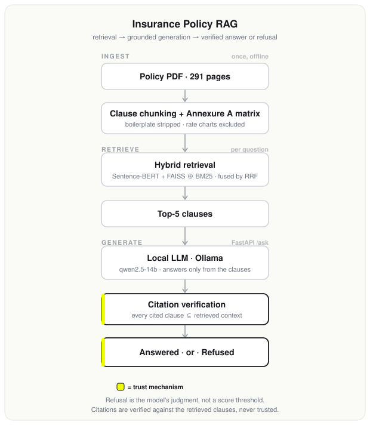

# Insurance Policy Q&A (RAG)

Ask a health insurance policy a plain-English question. Get an answer grounded in the policy
text, with the exact clause it came from. If the policy does not answer the question, the system
says so instead of guessing.

**Runs entirely on your machine. No API key, no billing, nothing to sign up for.** Generation uses
a local model through Ollama, so anyone who clones this repo can run the whole pipeline end to end,
including the FastAPI backend. An Anthropic backend is included as an optional frontier baseline,
but nothing here depends on it.

Retrieval was built and verified first, on purpose. It is the gate: if the right clause does not
come back, no prompt downstream can rescue the answer, and measuring answer quality on top of
broken retrieval only measures noise.

## Architecture

<p align="center">
  
</p>

The two boxes in accent are what make this more than a demo: refusal is the model's judgment
rather than a retrieval-score threshold (the scores do not separate answerable from unanswerable
questions), and every citation is checked against the retrieved clauses instead of trusted.

---

## The document

The source is a 291-page health insurance prospectus (product UIN HDFHLIP26058V082526). Two facts
about it shaped every design decision here.

**It is eight plans, not one.** Optima Suraksha, Optima Secure, Optima Super Secure, Optima Secure
Global, Optima Secure Global Plus, Optima Select, Optima Lite, Optima Secure +. They share one
clause set, so most questions have a different correct answer per plan. Room rent is "At Actuals"
in six plans, capped at 1% of base sum insured per day in Optima Lite, and limited to a Single
Private room in Optima Select. Secure Benefit is worth 100% of base sum insured in one plan and
200% in another whose name differs by a single word. A system that retrieves the clause but drops
the plan qualifier gives confidently wrong answers about money.

**It is mostly not prose.** Only about 71 of the 291 pages carry policy text.

| Pages | Content | In the index? |
|---|---|---|
| 1-58 | Policy body: coverage, exclusions, claims, terms | yes |
| 59-66 | Annexure A, the plan comparison matrix | yes, hand-structured (see below) |
| 67-68 | Annexure B, non-medical items list | yes |
| 69-288 | Premium rate charts (age x sum insured x plan x city tier) | **no** |
| 289-291 | Lists II/III/IV, non-payable items | yes |

Pages 69-288 are 220 pages of pure numeric lookup tables. They are excluded deliberately.
Embedding them would flood the index with hundreds of near-identical numeric chunks, and "what is
the premium for a 35-year-old" is a structured lookup, not a semantic retrieval problem. The system
treats premium questions as an explicit, documented refusal rather than pretending to answer them.
Sections 16 and 17 (worked premium computation examples) are excluded on the same grounds, so the
scope boundary stays consistent.

## Design decisions that mattered

**Chunk on clause boundaries, never on fixed windows.** A 512-token window cutting through Section
10.1.b leaves half a waiting-period rule in one chunk and half in the next, and neither chunk
answers the question. Worse, a chunk containing "shall be excluded until the expiry of 24 months"
without the sentence establishing *what* is excluded retrieves well and reads authoritatively while
being unusable. Chunks follow the document's own numbering, so the chunk id doubles as the citation
anchor: the same string that identifies a chunk is the string a user needs to find it in the PDF.

**Each exclusion is its own chunk.** Section 10.1 runs a through r, carrying the IRDAI standard
codes Excl01 to Excl18. "Is maternity covered?" is answered by 10.1.r alone, so 10.1.r is its own
citable unit.

**Annexure A is transcribed by hand, and the transcription is tested.** It is the only place in the
document that says what a benefit is worth under a given plan, and it is the one table the PDF text
layer destroys. Extracted raw, its eight columns collapse into a vertical stream where values lose
their plan association: you get `Not Covered / Equal to 100% of / Base sum insured / Equal to 200%
of` with no way to tell which plan owns which. So `src/ingest/annexure_a.py` types the matrix out by
hand and emits one chunk per benefit row with each plan's value written next to that plan's name.
Hand-transcription trades one risk for another, because a typo here becomes a wrong answer about
money with a citation attached. `tests/test_annexure_a.py` therefore checks every transcribed value
against the source page it claims to come from.

**Boilerplate detection is measured, not hardcoded.** An IRDAI registration footer repeats on every
page. A line recurring on 15% or more of pages is treated as furniture and stripped. That threshold
sits in a gap found in the data: real prose lines never recur above ~3%, the footer recurs at 20%
and 80% (it is typeset in two different line wraps), and the band between holds nothing but
rate-chart rows. Detecting furniture by frequency instead of by regex means the pipeline transfers
to other insurers' documents.

## Retrieval

Hybrid, because insurance rewards exact match and paraphrase equally.

- **Dense**: Sentence-BERT (`all-mpnet-base-v2`) embeddings over a FAISS `IndexFlatIP`, cosine
  similarity. Catches paraphrase. A user asks "can I get treatment at home instead of being
  admitted"; the clause says "Home Health Care ... would require In-patient Care at a Hospital".
  Almost no term overlap, and dense finds it.
- **Sparse**: BM25 with Snowball stemming. Not a baseline to be beaten. "Co-payment", "deductible"
  and "sub-limit" are three different things with three different financial consequences, and a
  bi-encoder places them close together because they are all "money you pay". "Optima Secure" and
  "Optima Super Secure" differ by one token and by crores; their cosine similarity is near 1.0.
  BM25 matches tokens, not vibes.
- **Fusion**: Reciprocal Rank Fusion, plus a signal gate on BM25 (below).

## Results

Measured on 31 hand-built questions with known gold clauses, plus 3 deliberate refusals. Ablation
is like-for-like: all three retrievers are deduplicated by section, so `k` means k distinct clauses.

| retriever | recall@3 | recall@5 | recall@10 | MRR@5 |
|---|---|---|---|---|
| dense (SBERT + FAISS) | 80.6% | **87.1%** | **93.5%** | **0.723** |
| sparse (BM25) | 54.8% | 71.0% | 77.4% | 0.482 |
| hybrid (RRF) | **83.9%** | 87.1% | 90.3% | 0.678 |

Recall@5 by difficulty (hybrid): easy 85.7%, medium 72.7%, **hard 100%**.

**Honest reading of this table: the hybrid does not beat dense retrieval on this question set.**
It wins at k=3, ties at k=5, and loses at k=10 and on MRR. Reporting it as a win would be
dishonest.

Two things are worth saying about that rather than hiding it. First, the failure modes are
decorrelated, which is the real argument for keeping both: BM25 alone finds the clauses dense
misses (the "24 consecutive hours" minimum-stay rule, the restore benefit), and the union of the
two covers 29 of 31. Second, this question set is written in a policyholder's natural voice, which
structurally favours paraphrase and therefore favours dense. A production query log would contain
far more exact-term lookups ("PED waiting period", "Excl18", "co-payment"), which is where BM25
earns its place. The set measures what it measures, and it does not settle the hybrid question.

The **hard** questions being at 100% is the result that matters most. Those are the plan-specific
ones, where a single-answer response is wrong for at least two of the eight plans. That is the
hand-structured Annexure A working.

### The one that would have looked like a win

Equal-weight RRF originally scored **83.9%, below dense alone at 87.1%**. Fusion underperforming
its best component is a bug, not a tradeoff.

The cause is that RRF fuses ranks and ignores magnitude, so it cannot tell a confident BM25 match
from a desperate one. Nearly every chunk in an insurance corpus shares "policy" or "claim" with
nearly every question, so BM25 always returns a full ranked list and its tail is noise carrying
real rank positions. The arithmetic: junk ranked #12 by both retrievers scores 2/72 = 0.0278 and
beats the gold clause ranked #1 by dense alone at 1/61 = 0.0164.

The fix is not a fusion weight. Weighting barely moved the number (83.9% at every ratio tested).
The fix is to make BM25 abstain when it has nothing to say: `BM25_SIGNAL_GATE` drops sparse hits
scoring below 40% of BM25's own top hit for that query.

The value 0.4 is chosen for the mechanism, not tuned. Recall@5 measures 87.1% at gates 0.3, 0.4 and
0.6, and 90.3% at 0.5. A lone spike inside a flat band is one question out of 31 flipping (each
question is worth 3.2 percentage points), not a real optimum. Taking the 90.3% would have been
fitting the eval set and quoting the result as a finding.

## Generation, and the refusal problem

The generator takes the retrieved clauses and writes an answer that cites them. It is constrained
to answer only from those clauses, to cite the section it used, and to say so when the policy does
not answer the question. It returns a schema-constrained JSON object, not prose, so the citation
and the refusal are machine-checkable rather than something to be read out of a paragraph.

### The refusal gate I planned does not work

The design was to refuse cheaply, before spending a model call: if no retriever scores a chunk
above some threshold, the question has no answer here. Measured, that is wrong, and not narrowly.

| | top dense score |
|---|---|
| 31 answerable questions | 0.341 - 0.647 (median 0.546) |
| 3 unanswerable questions | 0.479 - **0.640** |

The distributions overlap almost entirely. A threshold that rejects all three unanswerable
questions also rejects **29 of the 31 answerable ones**. BM25 separates no better.

The cause is structural, not a tuning failure. "What is this insurer's claim settlement ratio?"
*is* an insurance question, phrased in the document's own vocabulary, and it embeds right next to
real insurance clauses. **Retrieval similarity measures topical relatedness. Answerability is a
different property**, and no threshold on the first recovers the second.

So refusal is a semantic judgement and it belongs to the model. It is a first-class outcome in the
prompt rather than a fallback, and there is a deterministic backstop underneath it.

### The backstop: citations are verified, not trusted

Every section the model cites is checked against what was **actually placed in its context window**.
A fabricated citation is the one failure a reader cannot catch for themselves, because a citation
is exactly the thing people trust without checking: an answer citing "Section 3.7" that the model
was never shown is fluent, authoritative, wrong, and indistinguishable from a correct one.

That check does not depend on the model cooperating, which matters more with a small local model
than with a frontier one. It is why it is a hard check and not a prompt instruction.

### Generation results, and a hypothesis the data killed

Measured on all 34 questions with `qwen2.5:14b-instruct` running locally. Every metric here is
deterministic (set membership, status checks) — none needs a model to grade a model, which would
be circular when the only model available is the one under test. Answer text is written to
`eval/results.json` for reading against the hand-written references.

| metric | value |
|---|---|
| retrieval: gold clause in top-5 | 27/31 (87%) |
| citations verified (cited what it was shown) | **34/34 (100%)** |
| cited the correct clause | 27/30 (90%) |
| correctly refused the 3 unanswerable | 3/3 (100%) |
| wrongly refused an answerable one | 1/31 (3%) |
| plan-dependent questions flagged | 4/4 (100%) |

The interesting part is a design decision I got wrong and the measurement reversed.

I noticed on a few questions that constraining the model's output to a JSON schema seemed to hurt
its answers — the room-rent question came back "the document does not specify" with all eight plan
values sitting in its context. So I built a **two-stage** pipeline: reason in free text first,
then extract the structure in a second constrained call. It felt obviously better.

Measured against a *fair* single-stage baseline (same instructions, plus the field guidance it
needs), across all 34 questions, two-stage **lost**:

| | 1-stage (kept) | 2-stage (rejected) |
|---|---|---|
| citations verified | **100%** | 61.8% |
| cited correct clause | **90%** | 76.7% |
| seconds per question | **38.5** | 59.7 |

One-stage hallucinated zero citations; two-stage hallucinated on 13 of 34. The reason is specific:
free-text prose reaches for fine-grained sub-clause references like "as per 4.6.iv.b" and
"10.1.q.i", which the system indexes only at section level and cannot verify, and the extraction
step faithfully copies them out. The single constrained call forces a discrete, section-level
commitment the model is far more careful with. And the room-rent failure that started the whole
thing turned out to be a **prompt bug** — the baseline had been missing its field guidance — not a
property of constrained decoding at all. With the fair prompt, one-stage answers room rent
correctly.

The two-stage code is kept, behind `evaluate.py --stages`, so the comparison reproduces. Reporting
the approach that lost, and why the anecdote that motivated it was a confound, is the point.

## Known limitations

- **n=34 is small.** Every figure above carries roughly ±3 points of resolution per question, and
  the generation run is a single pass, not an average. Nothing here is validated on a held-out
  split, and at this size it should not be.
- **The generator still confabulates when retrieval misses.** On "in what order does the policy use
  up my benefit buckets", the answering clause (13.2) was not retrieved, and the model stitched a
  plausible-sounding order out of adjacent clauses rather than refusing. Its citations were real
  sections, so the citation guard passed — the guard proves a citation was *shown*, not that the
  *claim* is supported by it. That gap is real and not currently closed.
- **The maternity answer drops the ectopic-pregnancy exception.** The model answers "no, excluded"
  correctly but omits the one case the clause carves out, which is cover a reader would never learn
  they had. A more complete answer is in the clause; the model does not always spend the words.
- **Very short clauses are hard to retrieve.** Section 10.2.l is the entire text "Treatment taken
  on outpatient basis". It never says "not covered" anywhere, so a user asking "are my regular
  doctor visits covered?" gets no lexical and little semantic signal. Each exclusion chunk now
  restates its parent's denial, which helped, but this question still misses.
- **Very short clauses are hard to retrieve.** Section 10.2.l is the entire text "Treatment taken
  on outpatient basis". It never says "not covered" anywhere, so a user asking "are my regular
  doctor visits covered?" gets no lexical and little semantic signal. Each exclusion chunk now
  restates its parent's denial, which helped, but this question still misses.
- **Unit paraphrase defeats both retrievers.** "I've had the policy for six years" does not
  retrieve the Moratorium clause, which is written as "sixty continuous months". Neither retriever
  does the arithmetic.
- **Premium questions are out of scope by design**, not by accident. The rate charts exist in the
  source PDF and are deliberately not indexed.
- MRR is lower for the hybrid than for dense, because RRF discards score magnitude and flattens the
  top of the ranking.

## Layout

```
src/
  config.py              page regions, thresholds, model + fusion constants
  ingest/
    extract.py           PDF text, frequency-based boilerplate stripping
    chunk.py             clause-boundary chunking, token-window aware
    annexure_a.py        hand-structured plan matrix (the 8-column table)
  retrieval/
    dense.py             Sentence-BERT + FAISS
    sparse.py            BM25 + stemming + signal gate
    hybrid.py            RRF fusion, section dedupe
  generation/
    prompt.py            the answering prompt (the whole safety boundary)
    backends.py          local Ollama (default) and optional Anthropic
    answer.py            grounding, refusal, citation verification
  api/
    app.py               FastAPI /ask + /health
eval/
  qa_pairs.yaml          34 ground-truth pairs (31 answerable, 3 refusals)
scripts/
  build_index.py         PDF -> chunks -> both indexes, with invariant checks
  verify_retrieval.py    the retrieval gate: recall@k, MRR, per-retriever ablation
  query.py               inspect what retrieval returns for one question
  ask.py                 ask the policy a question (full pipeline)
  evaluate.py            end-to-end eval; --stages reproduces the 1-vs-2-stage result
tests/                   49 tests: chunking, Annexure A, generation guards, API contract
```

## Run it

Generation runs locally through [Ollama](https://ollama.com). Install it, then:

```bash
ollama pull qwen2.5:14b-instruct

python3.12 -m venv .venv && .venv/bin/pip install -r requirements.txt

# place the prospectus PDF at data/raw/ (see data/raw/README.md), then:
.venv/bin/python -m scripts.build_index          # PDF -> chunks -> FAISS + BM25
.venv/bin/python -m scripts.verify_retrieval     # retrieval metrics
.venv/bin/python -m pytest tests/ -q             # 49 tests

# ask a question end to end:
.venv/bin/python -m scripts.ask "is maternity covered in the first year"

# or serve it:
.venv/bin/uvicorn src.api.app:app --reload
# then: curl -s localhost:8000/ask -H 'content-type: application/json' \
#         -d '{"question":"what is my room rent limit?"}'
```

The `/ask` response carries the answer plus the two fields that make it trustworthy: `status`
(`answered` / `not_in_document` / `out_of_scope`) and `citations_verified`. A caller can branch on
a refusal, or on an unverifiable citation, without parsing the prose.

`build_index` refuses to build an index containing a duplicate chunk id or a chunk exceeding the
embedding window. Both were real bugs, and both were silent: a duplicate id means citing the wrong
clause, and an over-window chunk is truncated by SentenceTransformer without warning, so it looks
correct in every artifact while being partly invisible to the retriever.

## A note on macOS / Apple Silicon

`faiss-cpu` and `torch` each vendor their own OpenMP runtime. Loading both into one process is
undefined behaviour, and if faiss's copy loads first, torch segfaults the moment it dispatches real
multi-threaded work. It does not reproduce on short strings, which makes it look flaky rather than
deterministic. `src/retrieval/dense.py` imports `sentence_transformers` before `faiss` so torch's
runtime wins. Do not let an import sorter reorder those two lines.

## Next

1. Close the confabulation-on-retrieval-miss gap: when the answering clause is not retrieved, the
   generator should be pushed harder toward "not in these clauses" instead of assembling an answer
   from neighbours. This is the one open correctness hole (see limitations).
2. A hosted demo. It needs a hosting decision the local-model choice complicates: a free static
   host cannot run a 9GB model, so the options are a small model on a cheap GPU host, a paid model
   API behind the endpoint, or a recorded walkthrough plus this runnable repo.
3. Expand the question set well beyond 34, weighted toward exact-term lookups, and hold out a split
   before quoting any tuned number.
